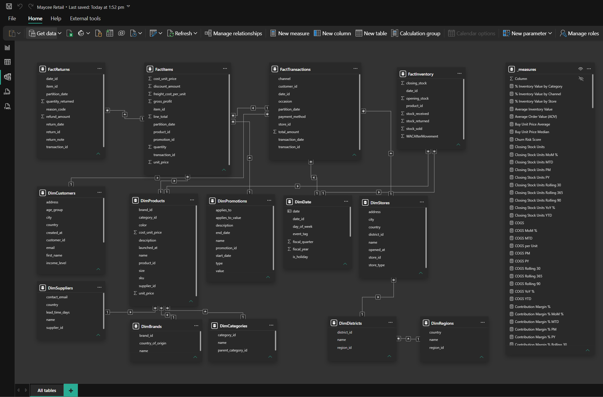

## **Maycee Retail BI Model (WIP)**  
A retail BI system built in Power BI with semantic modelling, time‑intelligence, and KPI frameworks across Sales, Margin, Inventory, Returns, and Customer metrics. Designed for clear reporting, performance tracking, and practical commercial insights.

**Latest Update (Aug 2026):** Public dashboard link added; Page 2 trend analysis now live.

---

## Live Dashboard (Public)
The Maycee Retail BI dashboard is published publicly via Power BI Service.

🔗 **View the live report:**  
https://app.powerbi.com/view?r=eyJrIjoiY2NmODk3NWQtNmE5ZC00MjY3LTk3ZTktNzk2ZWY4ZTk2Zjc4IiwidCI6ImZjN2U5OTZiLWVhYjAtNDcxZS05NTUwLTY0ZjUzZTQ1ODdhYyJ9&embedImagePlaceholder=true

This WIP version includes KPI frameworks, time‑intelligence, and Page 2 Product & Margin trend analysis.

---

## **1. Project Scope**  
This project demonstrates the design and build of a complete BI model, including:

- Structured data modelling (fact/dimension schema)  
- Time‑intelligence layer for multi‑period comparison  
- KPI frameworks across core retail functions  
- Performance reporting and insight generation  
- Commercial storytelling through metrics  

The goal is to showcase practical BI capability aligned to real‑world reporting needs.

---

## **2. What is Maycee Retail?**  
Maycee Retail is a fictional multi‑category retail business created for BI modelling and KPI development.  
It includes:

- Product sales  
- Margin performance  
- Inventory movement  
- Returns behaviour  
- Customer activity  

This provides a realistic environment for building commercial reporting and KPI frameworks.

---

## **3. Key Features**  
- Full semantic model with clean relationships  
- Time‑intelligence measures (YTD, YoY, MoM, rolling periods)  
- KPI layers for Sales, Margin, Inventory, Returns, and Customer  
- Structured reporting aligned to commercial decision‑making  
- Practical insight generation for retail performance  

---

## 4. KPI Frameworks
The model includes a structured KPI layer organised into Sales, Margin, Inventory, Returns, and Customer KPI groups.  
These KPIs support commercial reporting across core retail functions.

### **Sales KPIs**
Revenue, units sold, average selling price, period comparisons.

### **Margin KPIs**
Gross margin $, margin %, profitability trends.

### **Inventory KPIs**
Stock levels, stock movement, ageing indicators.

### **Returns KPIs**
Return rate, return value, product‑level return behaviour.

### **Customer KPIs**
Customer activity, repeat behaviour, basic segmentation, contribution to revenue.

---

## 5. Model Structure
The BI model is built using:

- Fact tables for sales, inventory, returns  
- Dimension tables for products, customers, dates, stores  
- Semantic layer for business‑ready fields  
- Time‑intelligence layer for comparative reporting  
- KPI layer for structured performance metrics  

This structure supports scalable reporting and clear commercial insights.

## Semantic Model (Power BI)
Below is the semantic model used for the Maycee Retail BI system.  
It shows the fact/dimension structure, relationships, and KPI measure layer.

---

## **6. Files Included**  
- **Maycee Retail BI Model.pbix** — main Power BI file  
- **/screenshots** — visuals (to be added)  
- **/kpi-docs** — KPI notes (to be added)  

---

## **7. Status**  
This repository is updated progressively as new modelling, KPIs, and visuals are completed.

---
